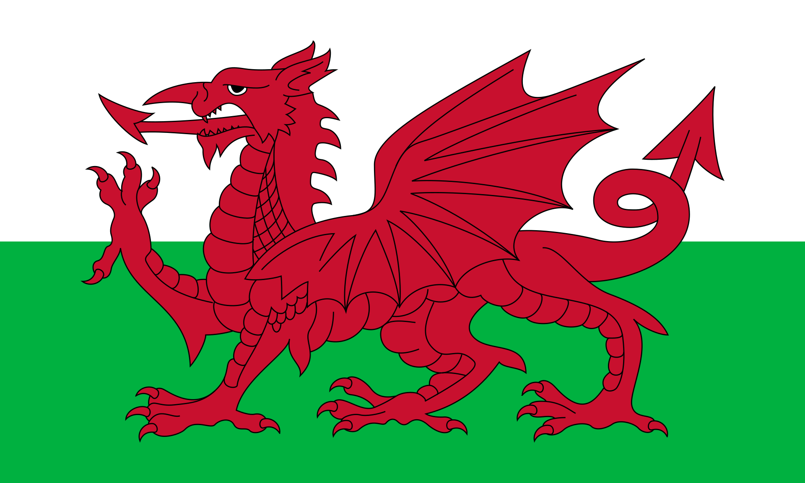
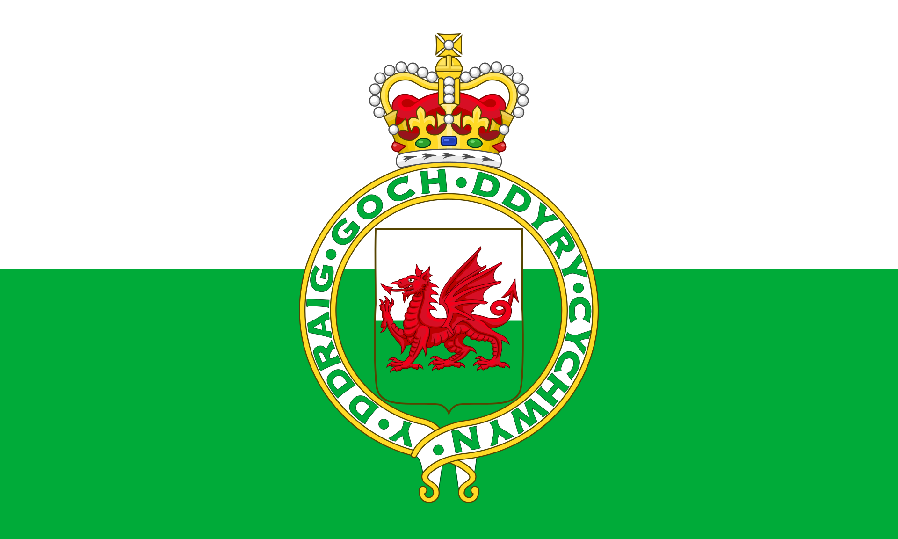
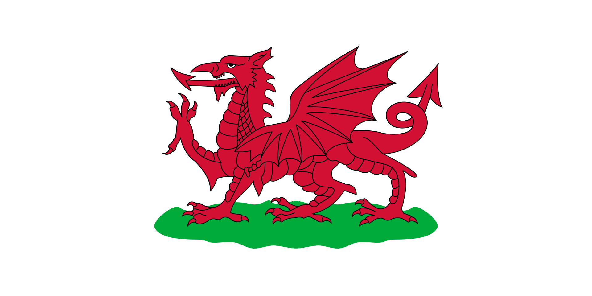
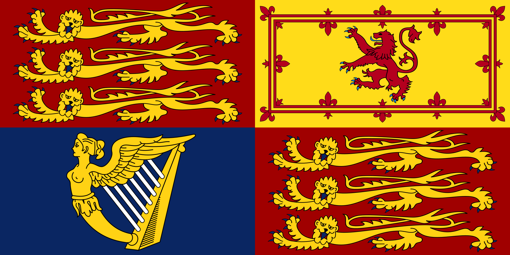
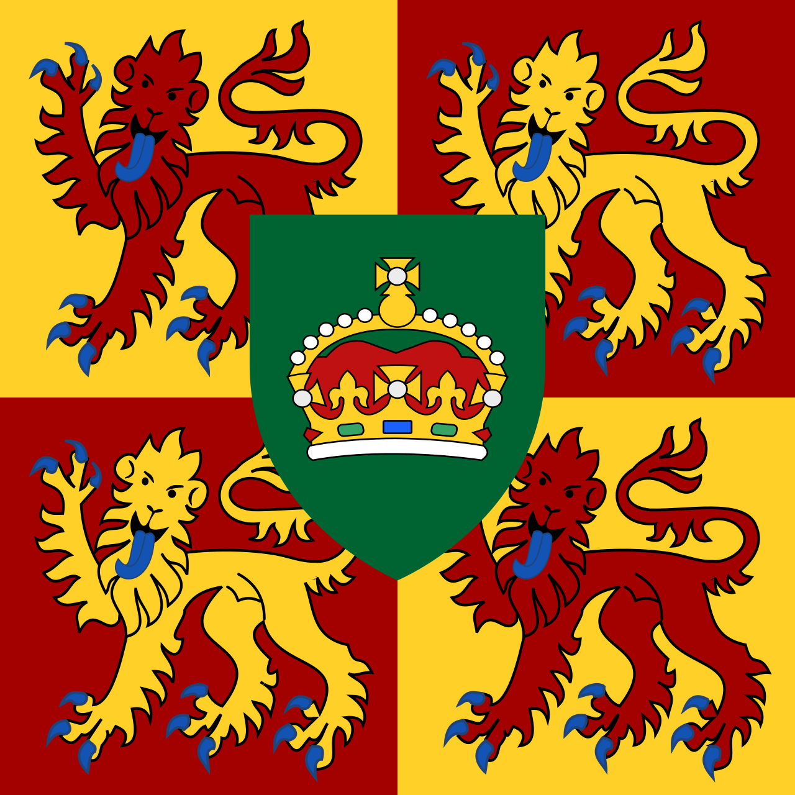
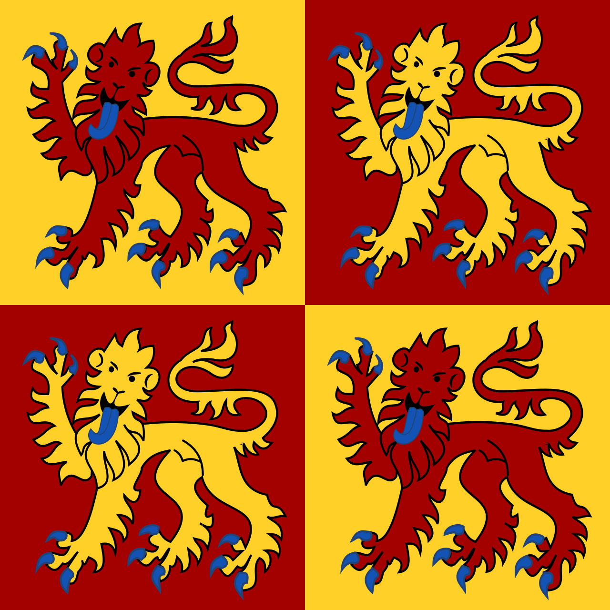
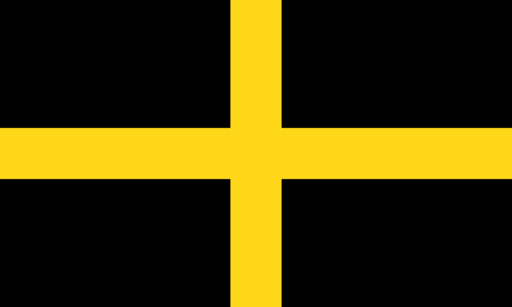
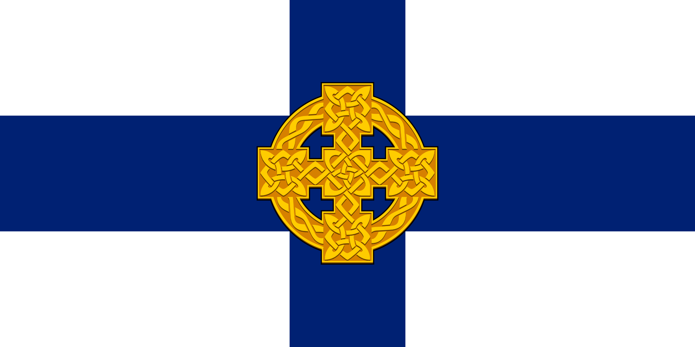
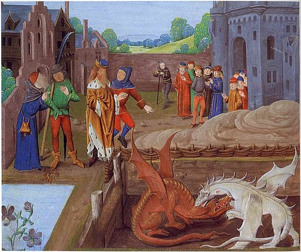

[&larr; return to Learning Center](../learn/)

Welsh culture is rich in language, history, mythology, and symbolism. This page provides an overview of some of the key elements that define the cultural identity of Wales.

## Welsh Language
Welsh (*Cymraeg* or *y Gymraeg*) is a Celtic language of the Brittonic subgroup that is native to the Welsh people. 
It is spoken natively in Wales by about 18% of the population, as well as by some communities in England, and in **Y Wladfa**, the Welsh colony in Chubut Province, Argentina.

The **Welsh Language (Wales) Measure 2011** gave the language official status in Wales. Welsh and English are de jure official languages of the **Senedd**, the Welsh parliament.

Although modern understanding often splits Welsh into northern (*Gogledd*) and southern (*De*) 'dialects', the traditional classification of four Welsh dialects remains academically useful:
+ ***Gwyndodeg***, the Gwynedd dialect
+ ***Powyseg***, the Powys dialect
+ ***Dyfedeg***, the Dyfed dialect
+ ***Gwenhwyseg***, the dialect of Gwent and Morgannwg

A fifth dialect is **Patagonian Welsh**, which has developed since the start of Y Wladfa in 1865. It includes Spanish loanwords and regional terms, but the language remains largely consistent across the lower Chubut Valley and the Andes.

[Read more on Wikipedia](https://en.wikipedia.org/wiki/Welsh_language#)

[See the Welsh Language (Wales) Measure 2011](https://www.legislation.gov.uk/mwa/2011/1/contents/enacted) 

## National Symbols of Wales
### Flags
#### National Flags
The Flag of Wales, also known as *Y Ddraig Goch* ('the red dragon'), in official use since 1959:

 

A historical flag used from 1953 until 1959, depicting the Royal Badge of Wales after its augmentation of honour:

 

A historical flag used from 1807 until 1953:

#### Royal Standards
The Royal Standard, in use since 1837 in England, Wales and Northern Ireland:

 

The Standard of the Prince of Wales, used only in Wales:

 

The banner of the princely House of Aberffraw and the Kingdom of Gwynedd famously used by Llywelyn the Great, Llywelyn ap Gruffudd and Owain Lawgoch. The Prince of Wales uses a version of this flag today, emblazoned with a Crown on a green shield (seen above).

#### Religious Flags
The flag of Saint David:

 

The flag of the Church in Wales:

### The Welsh Dragon (*y Ddraig Goch*, meaning 'the red dragon')
The red dragon is a heraldic symbol which has come to represent Wales.

#### Military Use
The term "dragon" (in Latin, _draco_) dates back to the Roman period and this in turn is likely inspired by the symbols of the Scythians, Indians, Persians, Dacians or Parthians.

After the Roman withdrawal it has long been suggested that resistance to the Saxon incursion was led either by Romans or Romanised Britons, and this is evident in the names attributed in legend to those who led the opposition, including **Ambrosius Aurelianus** and perhaps **Artorius**. 
This could account for how the Roman terminology came to be adopted by Britons.

From the first extant written records of the Britons, it became evident that dragons were already associated with military leaders. 
**Gildas**, writing in about 540, spoke of the Briton chieftain **Maglocunus** (*Maelgwn Gwynedd* in Welsh) as the "*insularis draco*"

The early Welsh poets **Taliesin** and **Aneirin** both extensively use dragons as an image for military leaders, and for the Britons the word dragon began to take the form of a term for a war leader, prince or ruler.

#### Mythology
The Red Dragon first appears in myth in the ancient ***Mabinogion*** story of ***Lludd and Llefelys*** where it is confined, battling with an invading white dragon, at Dinas Emrys. In that story, Lludd confines the dragons at Dinas Emrys.

[Read more about *Lludd and Llefelys*](https://en.wikipedia.org/wiki/Lludd_and_Llefelys) 

The tale is taken up in the _**Historia Brittonum**_, written by **Nennius**. 
*Historia Brittonum* was written c. 828, and by this point the dragon was no longer just a military symbol but associated with a coming deliverer from the Saxons. 

In chapters 40–42 there is a narrative in which the tyrant **Vortigern** flees into Wales to escape the Anglo-Saxon invaders. 
There he chooses a hill-fort as the site for his royal retreat and attempts to build a citadel, but the structure collapses repeatedly. 
A young boy, Emrys (**Ambrosius Aurelianus**), revels to Vortigern the reason for the collapsing towers: a hidden pool containing two dragons, one red and one white, representing the Britons and the Saxons specifically, buried beneath the foundation. 

He explains how the White Dragon of the Saxons, though winning the battle at present, would soon be defeated by the Welsh Red Dragon. 
After Vortigern's downfall, the fort was given to High-King Ambrosius Aurelianus, known in Welsh as Emrys Wledig, hence the fort's name.

[Read more about *Historia Brittonum*](https://en.wikipedia.org/wiki/Historia_Brittonum)

## Welsh Mythology

Welsh mythology is a complex tapestry of stories, heroes, gods, and magical beings. Much of what survives comes from medieval manuscripts, notably the **Mabinogion**, which preserves Celtic oral traditions in written form. These myths were influential across Britain and have inspired literature, art, and national identity.

### The Mabinogion
The **Mabinogion** is a collection of prose tales compiled between the 11th and 13th centuries from earlier oral traditions. It contains four branches centered on the **Children of Llŷr** and other legendary families:

+ **Pwyll Pendefig Dyfed (Pwyll, Prince of Dyfed)** – The story of Pwyll’s adventures in the Otherworld, his friendship with Arawn (king of Annwn), and his marriage to Rhiannon.
+ **Branwen ferch Llŷr (Branwen, Daughter of Llŷr)** – A tale of war between Ireland and Britain caused by the mistreatment of Branwen, culminating in tragedy and heroism.  
+ **Manawydan fab Llŷr (Manawydan, Son of Llŷr)** – Follows Manawydan’s struggles in a magically cursed land, combining cleverness with patience.  
+ **Math fab Mathonwy (Math, Son of Mathonwy)** – A complex story of magic, transformations, and the creation of **Blodeuwedd**, a woman made from flowers.

The Mabinogion also includes other notable tales such as *Lludd and Llefelys*, *Culhwch and Olwen*, and the adventures of King Arthur in Welsh tradition.

### Legendary Figures and Heroes
- **King Arthur** – The earliest references to Arthur appear in Welsh poetry and the Mabinogion. He is portrayed as a heroic leader, often connected to magical and prophetic elements.  
- **Bran the Blessed (Bendigeidfran)** – A giant and king whose severed head continues to speak and guide his people, symbolizing protection and wisdom.  
- **Rhiannon** – A goddess-like figure associated with horses, sovereignty, and endurance. She represents the Otherworld and the connection between mortals and divine forces.  
- **Blodeuwedd** – A woman created from oak, broom, and meadowsweet flowers to be the wife of Lleu Llaw Gyffes. Her story explores betrayal, punishment, and transformation into an owl, symbolizing cunning and consequence.  
- **Lludd and Llefelys** – Brothers who confront threats to Britain, including dragons, plagues, and invasions, emphasizing the duality of chaos and order.

### Influence on Culture
Welsh mythology is not just a historical curiosity—it continues to influence:

- **Literature:** Tolkien, Susan Cooper, Lloyd Alexander, and other authors drew heavily on Welsh myth.  
- **Art and Music:** Symbols, tales, and legendary characters are celebrated in paintings, sculptures, and music.  
- **Festivals and Storytelling:** Eisteddfodau and cultural events preserve oral traditions through poetry, storytelling, and drama.  
- **National Identity:** Figures like Arthur, Rhiannon, and the Red Dragon have become emblems of Welsh pride and heritage.

### Suggested Readings
- *The Mabinogion*, translated by Lady Charlotte Guest  
- *The Celtic Heroic Age* by John Koch  
- *Welsh Fairy Tales* by W.J. Thomas  
- Online: [The Mabinogion at Wikisource](https://en.wikisource.org/wiki/The_Mabinogion)

